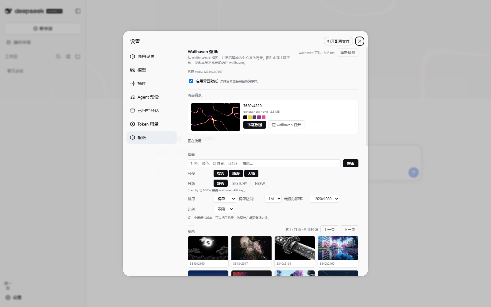

# dsh-wallhaven-wallpaper · Wallhaven 壁纸

> 给 DeepSeek Harness 的 Web GUI 换上一层壁纸：**在设置里搜 wallhaven.cc，点一下就把那张图铺成界面背景**，并可以随时把原图存到本地。

<p align="center">
  
  
  
</p>

---

## 它解决什么问题

Harness 的界面配色是一整套 `--dsw-*` 设计 token，没有任何「换背景图」的入口。而 wallhaven 这类图站，
在不少网络里恰好是**浏览器打不开、命令行也打不开**的那一类——DNS 被污染、需要走代理、公司网只放行白名单。

本插件把这两件事一起解决：

- **宿主端取图**：`wallhaven.cc` 的 API 调用与图片字节全部由 DSH 宿主进程发出，浏览器只跟
  `127.0.0.1` 上的本插件路由说话。所以哪怕浏览器完全连不上 wallhaven，壁纸照样显示。
- **代理是一等公民**：宿主端自己实现 HTTP `CONNECT` 隧道，可以给本插件单独指定代理，
  也可以直接复用环境里的 `HTTPS_PROXY`。
- **背景不是贴上去的**：插件读回当前主题真实的表面色，把它们**按更低的 alpha 重写**，
  于是壁纸从产品自己的界面里透出来，而不是盖在产品上面。不改写任何官方节点、不替换任何 Slot。

## 装完的效果

**设置 → 壁纸** 是一个完整页面：搜索、缩略图网格、翻页、当前背景预览，以及外观与访问设置。



侧边栏底部还有一个 **↻ 换一张**：从当前搜索条件里随机换一张，不用每次打开设置。

## 安装

```bash
dsh plugin --profile web add github:HaydenSmith1121/dsh-wallhaven-wallpaper
```

重启 `dsh web` 后生效。

> 也可以从 npm 或本地 tarball 安装：把上面的 spec 换成包名 / `.tgz` 路径即可。

## 用法

### 1. 如果本机需要代理（**先看这一条**）

先在浏览器里试一下能不能打开 <https://wallhaven.cc>。打不开的话，在**设置 → 壁纸 → 访问 → 代理**里
填上你本机代理的 HTTP 端口，例如：

```
http://127.0.0.1:7897
```

留空时会依次读取环境变量 `HTTPS_PROXY` / `https_proxy` / `ALL_PROXY` / `HTTP_PROXY`。
只支持 `http://` 与 `https://` 代理（也就是所有 Clash / mihomo / v2rayN / Surge 默认暴露的那一个端口）；
SOCKS 不在支持范围内，请在代理客户端上开一个 HTTP 端口。

填好后点右上角 **重新检测**：状态行会给出 `wallhaven 可达 · xxx ms`，或者在连不上时直接说明原因
（DNS 失败、代理拒绝、401、429 各自有各自的措辞）。

### 2. 搜索并铺上

1. **分类 / 分级 / 排序 / 最低分辨率 / 比例**：改一下就会立刻按新条件重搜。
   默认 `榜单 · 近一月 · ≥1920×1080`，这是桌面壁纸比较稳的一组起点。
2. 在结果网格里点任意一张 —— **就是「设为背景」**：同一次点击会打开总开关并把这张图记下来。
3. 在 **当前背景** 里可以看到它的分辨率、分类、分级、体积与取色，并：

   | 按钮 | 作用 |
   |---|---|
   | **下载原图** | 存到「原图保存到」目录，文件名形如 `wallhaven-6ly7yw-3840x2160.png`；重名会自动加 `-1`、`-2` |
   | **在 wallhaven 打开** | 打开它的 wallhaven 页面 |

4. **外观**：
   - **界面不透明度**：`0` = 界面全透（壁纸最清楚），`1` = 壁纸被完全盖住。默认 `0.72`。
     卡片等抬升表面会自动比画布更实一点，这样壁纸透出来的同时层次还在。
   - **壁纸模糊** / **变暗遮罩**：想让文字更好读就加一点。
   - **填充方式**：铺满 / 完整 / 拉伸 / 平铺；**对齐**：居中 / 顶部 / 底部 / 左侧 / 右侧。
   - 菜单、弹窗、下拉这些浮层**故意保持不透明**——照片上的半透明菜单是读不了字的。

5. 关掉 **启用界面壁纸**，界面会**完全恢复原样**（插件会移除自己插入的图层与样式，不留残余）。

### 3. 下载到哪里

**设置 → 壁纸 → 访问 → 原图保存到**。留空则用 `图片/DSH Wallpapers`
（Windows 上是 `%USERPROFILE%\Pictures\DSH Wallpapers`）。

## 内容分级与 API Key

默认**只搜 SFW**，不需要任何 Key。想加 `Sketchy` / `NSFW`，或者想让搜索带上你 wallhaven 账号的
过滤器与黑名单，就去 <https://wallhaven.cc/settings/account> 生成一个 API Key，填进
**访问 → wallhaven API Key**。

两点实现上的取舍：

- Key 是**以请求头**（`X-API-Key`）发出的，不会出现在 URL 里 —— URL 会进代理日志和报错信息。
- **SFW 永远打开**：宿主端在校验时会把 `purity` 的第一位强行置 1，任何界面都存不下一个「只出成人内容」的配置。

## 它到底改了界面的什么

只改三类东西，全部可逆：

| 改了什么 | 怎么改的 |
|---|---|
| 一个背景图层 | 往 `body` 最前面插入一个 `position:fixed; z-index:-1` 的容器（壁纸 + 遮罩两层），`pointer-events:none` |
| 画布底色 | `html` 得到一个**不透明**底色，`body` 的背景于是不再上传给 canvas，而是作为一层半透明表面画在壁纸之上 |
| 四个表面 token | 读回 `--dsw-alias-bg-base`、`--dsw-specific-sidebar-fill`、`--dsw-alias-bg-layer-1/2` 的**当前真实值**，按 `表面不透明度` 重算 alpha 后写回 |

最后一条是它和「硬编码一套配色」的关键区别：

- DSH 把浅色 token 定义在 `body` 上、深色定义在 `body[data-ds-dark-theme]` 上，**不是 `:root`**。
  所以插件也写在 `body` 上，并用 `html:root body[data-ds-dark-theme]` 把深色那条压过去；
  写在 `:root` 上只会被继承，而被继承的值永远输给主题自己写在 `body` 上的那一条。
- 值是在运行时从 `getComputedStyle` 读的，所以**产品换配色、加新主题，本插件都跟着走**，
  不会留下一套过期的颜色。读之前会先摘掉自己上一次的覆盖，否则 alpha 会一层层叠上去。
- 主题切换（`theme/change`）后会重新读一遍再写回。

顺带一提：`--dsw-alias-brand-primary` 在 DSH 里是**中性高对比色**（浅色近黑、深色近白），
不是蓝色。所以插件里的主按钮文字用的是配对的 `--dsw-alias-label-primary-inverted`，
不是写死的白色——写死白色会在深色主题下变成白底白字。

## 网络与安全边界

- **只允许两个图片域名**：`w.wallhaven.cc` 与 `th.wallhaven.cc`，且必须 `https`。
  `/image` 路由在开 socket 之前先校验，所以它不可能被一个构造出来的链接变成任意转发器。
- **写操作要求同源**：`POST /config` 与 `POST /download` 只接受 `Origin` 与请求 `Host` 一致的请求。
  这不是身份认证，但它挡住了「你随手打开的某个网页偷偷把代理改掉」——那会是一个指向代理可达
  任何内网的请求伪造原语。DSH 的 web server 本身按设计不带认证，残余暴露面（能直接连到这个端口的
  任何东西）请按这个前提评估：**默认的仅回环姿态是安全的，把它暴露到局域网之前请先想清楚。**
- **不碰模型**：不注册任何模型工具，不改写任何路由，不发任何模型请求。KV cache 不受影响。
- **写文件只有两处**：自己的配置与缩略图缓存在 `$DSH_HOME/storages/dsh-wallhaven-wallpaper/` 下；
  只有你点了「下载原图」才会写到你指定的目录，且先写 `.part` 再改名。

## 它写在哪里

| 路径 | 内容 |
|---|---|
| `$DSH_HOME/storages/dsh-wallhaven-wallpaper/config.json` | 全部设置与「当前背景」记录（原子写：临时文件 + 改名） |
| `$DSH_HOME/storages/dsh-wallhaven-wallpaper/cache/` | 缩略图磁盘缓存，超过 400 个文件或 256 MB 时按最旧的先删 |
| 你指定的下载目录（默认 `图片/DSH Wallpapers`） | 点「下载原图」保存的原图 |

配置文档损坏时会被改名为 `config.json.corrupt-<时间戳>` 而不是删掉——里面可能有你的 API Key，
留一份现场总比默默清空好。

## 兼容性

- 基线：**DSH Desktop Beta 2.0.11-beta.1**（`@deepseek-ai/dsh` 0.1.6-alpha.1 一代的客户端）。
- 宿主半：一个前缀路由 `/plugins/dsh-wallhaven-wallpaper`（其余路由都挂在它下面），
  不发布服务、不改写官方行。
- 客户端半：占用 `settings.section`（id `wallhaven-wallpaper`）与 `sidebar.footer.action`
  （id `wallhaven-shuffle`）两个**增量**席位，`replaceRisk` 均为 `none`，不与任何替换官方渲染器的插件抢位。
- 运行时**零依赖**：只用 `node:http` / `node:https` / `node:tls` / `node:fs`，没有第三方包。
- Node `^22.19.0 || >=24.0.0`。

## 开发

```bash
npm run build          # src/ → lib/（宿主半原样拷贝；客户端半内联共享词汇 + 加 ModuleLoader 外壳）
npm run build:check    # 校验 lib/ 与 src/ 一致（CI 用）
npm test               # 67 项单元与集成测试
npm run verify:live    # 真连 wallhaven（需要 HTTPS_PROXY 或已配置代理）
npm run verify:client  # 真浏览器 + 真主题 token 的渲染验证
```

`lib/` **是提交进仓库的**：本包也可以直接从 GitHub 安装，而 git 安装不会跑我们的构建。
`build:check` 就是用来保证这份提交的产物诚实的。

构建里有两道闸门值得单独说：客户端 bundle 是**在一个函数体里求值**的（不是 ES module），
所以 `scripts/build.mjs` 会拒绝任何残留的 `import`/`export`，并且**用 `node:vm` 真正编译一遍** ——
少一个括号这种错误会在这里失败，而不是变成一个只有打开控制台才看得见的 SyntaxError。

`verify:client` 会在真实浏览器里加载 `lib/client.js`，把它挂进一个复刻外壳，
并**从已安装的 DSH 里提取真实的 `--dsw-*` token**再断言计算样式 —— 包括浅色与深色两套，
以及在两套配色下主按钮文字的对比度。它至少抓到过两个真 bug：覆盖写在了 `:root`（无效），
以及主按钮写死白色文字（深色主题下白底白字）。

## 许可

MIT

壁纸版权归各自原作者所有；本插件只做检索与下载，不重新分发任何图片。
