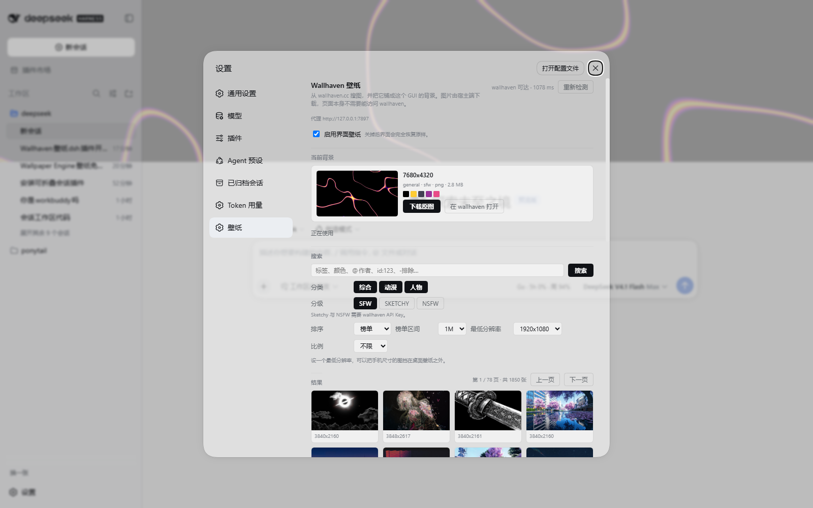

# dsh-wallhaven-wallpaper · Wallhaven 壁纸

> 给 DeepSeek Harness 的 Web GUI 换上一层壁纸：**在设置里搜 wallhaven.cc，点一下就把那张图铺成界面背景**，并可以随时把原图存到本地。

<p align="center">
  
  
  
</p>

> **换了 Harness 版本先看这里。** 本插件不按版本号判断兼容性，而是**逐个接口探测**：
> 每个调用独立成败，缺了哪一个就降级哪一个，并写进 **设置 → 壁纸 → 兼容性** 给你看。
> `0.1.6-alpha.1`、`0.1.7-rc.2`、`0.2.0-rc.1` 三代都实测跑通；其它版本请看那一页的报告，而不是猜。
> 详见 [兼容性](#兼容性)。

---

## 它解决什么问题

Harness 的界面配色是一整套 `--dsw-*` 设计 token，没有任何「换背景图」的入口。而 wallhaven 这类图站，
在不少网络里恰好是**浏览器打不开、命令行也打不开**的那一类——DNS 被污染、需要走代理、公司网只放行白名单。

本插件把这两件事一起解决：

- **宿主端取图**：`wallhaven.cc` 的 API 调用与图片字节全部由 DSH 宿主进程发出，浏览器只跟
  `127.0.0.1` 上的本插件路由说话。所以哪怕浏览器完全连不上 wallhaven，壁纸照样显示。
- **代理是一等公民**：宿主端自己实现 HTTP `CONNECT` 隧道，可以给本插件单独指定代理，
  也可以直接复用环境里的 `HTTPS_PROXY`。
- **背景不是贴上去的**：插件读回当前主题真实的表面色，把它们**按更低的 alpha 重写**，
  于是壁纸从产品自己的界面里透出来，而不是盖在产品上面。不改写任何官方节点、不替换任何 Slot。

## 装完的效果

**设置 → 壁纸** 是一个完整页面：搜索、缩略图网格、翻页、当前背景预览，以及外观与访问设置。



侧边栏底部还有一个 **↻ 换一张**：从当前搜索条件里随机换一张，不用每次打开设置。

## 安装

**先选对 profile —— 这是最容易装错的一步。**

| 你在用 | profile | 命令 |
|---|---|---|
| **DeepSeek Harness 桌面版** | `desktop` | `dsh plugin --profile desktop add github:HaydenSmith1121/dsh-wallhaven-wallpaper` |
| `dsh web` / `dsh tui` 命令行 | `web` | `dsh plugin --profile web add github:HaydenSmith1121/dsh-wallhaven-wallpaper` |

桌面版**只会启动 `desktop` 这个 profile**（`dsh-desktop-host` 里写死的），装进 `web` 是永远不会出现的。
反过来也一样。装完重启 Harness 生效。

> 也可以从 npm 或本地 tarball 安装：把上面的 spec 换成包名 / `.tgz` 路径即可。

装完想确认一下，不用打开界面：

```bash
dsh --profile desktop --dump-config | tail -3      # 末行应出现 dsh-wallhaven-wallpaper
curl http://127.0.0.1:<端口>/plugins/dsh-wallhaven-wallpaper/compat
```

第二条会直接告诉你 Harness 版本、profile、以及宿主路由到底注册上没有。

## 用法

### 1. 连不上 wallhaven？（**先看这一条**）

打开 **设置 → 壁纸**，页面一进来就自己测一次连通性，结果写在右上角状态行。

**多数情况下你不需要填任何东西。** 最常见的「连不上」不是网络坏了，而是：机器上跑着
Clash / mihomo / v2rayN / Surge，但 DSH 是从图形界面启动的，**没有继承 `HTTPS_PROXY`** ——
于是插件去直连一个被污染的 DNS，一直等到超时。这种情况插件会自己把它找出来：

```
检测到本机代理可用：http://127.0.0.1:7897 · 668 ms     [使用 http://127.0.0.1:7897]
```

点那一下就用上了。它会扫 `7897 7890 7891 10809 2080 6152 8118 8080 3128`
（全是 HTTP 代理端口；SOCKS 不在支持范围内，请在代理客户端上开一个 HTTP 端口）。
扫描**只对真的在监听的端口发请求**，所以通常几百毫秒就结束。

也可以自己填：**访问 → 代理**，例如 `http://127.0.0.1:7897`。**填了就不再自动探测** ——
你明确指定了一个地址，「它不通」才是有用的答案，再推荐一个只是噪音。留空时依次读
`HTTPS_PROXY` / `https_proxy` / `ALL_PROXY` / `HTTP_PROXY`。

**搜索前会先测连通性**：连不上就直接跳过这次搜索并说明原因，而不是让你等 20 秒再看到同一句话。
状态行里 DNS 失败、代理拒绝、401、429、Cloudflare 52x 各有各的措辞。

### 2. 搜索并铺上

1. **分类 / 分级 / 排序 / 最低分辨率 / 比例**：改一下就会立刻按新条件重搜。
   默认 `榜单 · 近一月 · ≥1920×1080`，这是桌面壁纸比较稳的一组起点。
2. 在结果网格里点任意一张 —— **就是「设为背景」**：同一次点击会打开总开关并把这张图记下来。
3. 在 **当前背景** 里可以看到它的分辨率、分类、分级、体积与取色，并：

   | 按钮 | 作用 |
   |---|---|
   | **下载原图** | 存到「原图保存到」目录，文件名形如 `wallhaven-6ly7yw-3840x2160.png`；重名会自动加 `-1`、`-2` |
   | **在 wallhaven 打开** | 打开它的 wallhaven 页面 |

4. **外观**：
   - **界面不透明度**：`0` = 界面全透（壁纸最清楚），`1` = 壁纸被完全盖住。默认 `0.72`。
     卡片等抬升表面会自动比画布更实一点，这样壁纸透出来的同时层次还在。
   - **壁纸模糊** / **变暗遮罩**：想让文字更好读就加一点。
   - **填充方式**：铺满 / 完整 / 拉伸 / 平铺；**对齐**：居中 / 顶部 / 底部 / 左侧 / 右侧。
   - 菜单、弹窗、下拉这些浮层**故意保持不透明**——照片上的半透明菜单是读不了字的。

5. 关掉 **启用界面壁纸**，界面会**完全恢复原样**（插件会移除自己插入的图层与样式，不留残余）。

### 3. 下载到哪里

**设置 → 壁纸 → 访问 → 原图保存到**。留空则用 `图片/DSH Wallpapers`
（Windows 上是 `%USERPROFILE%\Pictures\DSH Wallpapers`）。

## 内容分级与 API Key

默认**只搜 SFW**，不需要任何 Key。想加 `Sketchy` / `NSFW`，或者想让搜索带上你 wallhaven 账号的
过滤器与黑名单，就去 <https://wallhaven.cc/settings/account> 生成一个 API Key，填进
**访问 → wallhaven API Key**。

两点实现上的取舍：

- Key 是**以请求头**（`X-API-Key`）发出的，不会出现在 URL 里 —— URL 会进代理日志和报错信息。
- **三个分级都能单独开关，SFW 也是。** 想只搜 Sketchy，就先把 Sketchy 打开、再把 SFW 关掉。
  唯一不允许的是**三个全关**：wallhaven 表达不了「一个分级都不要」，会返回空结果，
  那看起来像「搜索坏了」而不是「你自己关掉的」。所以宿主端会退回 SFW，**界面也会把这句话说出来**
  —— 一个点了没反应的按钮，和一个坏掉的按钮，用户分不出来。

## 它到底改了界面的什么

只改三类东西，全部可逆：

| 改了什么 | 怎么改的 |
|---|---|
| 一个背景图层 | 往 `body` 最前面插入一个 `position:fixed; z-index:-1` 的容器（壁纸 + 遮罩两层），`pointer-events:none` |
| 画布底色 | `html` 得到一个**不透明**底色，`body` 的背景于是不再上传给 canvas，而是作为一层半透明表面画在壁纸之上 |
| 四个表面 token | 读回 `--dsw-alias-bg-base`、`--dsw-specific-sidebar-fill`、`--dsw-alias-bg-layer-1/2` 的**当前真实值**，按 `表面不透明度` 重算 alpha 后写回 |
| 一个自有 token | `--dsh-wh-on-brand`，只给插件自己的主按钮用；shell 不读它，所以没有视觉副作用 |

最后一条是它和「硬编码一套配色」的关键区别：

- DSH 把浅色 token 定义在 `body` 上、深色定义在 `body[data-ds-dark-theme]` 上，**不是 `:root`**。
  所以插件也写在 `body` 上，并用 `html:root body[data-ds-dark-theme]` 把深色那条压过去；
  写在 `:root` 上只会被继承，而被继承的值永远输给主题自己写在 `body` 上的那一条。
- 值是在运行时从 `getComputedStyle` 读的，所以**产品换配色、加新主题，本插件都跟着走**，
  不会留下一套过期的颜色。读之前会先摘掉自己上一次的覆盖，否则 alpha 会一层层叠上去。
- 重读由**两个**信号触发，缺一不可：`theme/change` 事件，以及 `MutationObserver` 对
  `body[data-ds-dark-theme]` 的观察。只要事件是不够的——它在属性落地**之前**触发，
  于是读到的是上一个配色，并且会据此把覆盖写到错误的选择器上（浅色下壁纸会完全透不出来）。
  详见上面「实测过的版本」。

顺带一提：`--dsw-alias-brand-primary` 在 DSH 里是**中性高对比色**（浅色近黑、深色近白），
不是蓝色。所以插件里的主按钮文字用 `var(--dsw-alias-label-primary-inverted, 兜底)`，
不是写死的白色——写死白色会在深色主题下变成白底白字（实测 1.05:1，等于看不见）。
那个 token 不在 DSH 公布的 token 表里，所以兜底值是**按对比度算出来的**黑或白，
而不是另一个写死的颜色。

## 网络与安全边界

- **只允许两个图片域名**：`w.wallhaven.cc` 与 `th.wallhaven.cc`，且必须 `https`。
  `/image` 路由在开 socket 之前先校验，所以它不可能被一个构造出来的链接变成任意转发器。
- **写操作要求同源**：`POST /config` 与 `POST /download` 只接受 `Origin` 与请求 `Host` 一致的请求。
  这不是身份认证，但它挡住了「你随手打开的某个网页偷偷把代理改掉」——那会是一个指向代理可达
  任何内网的请求伪造原语。DSH 的 web server 本身按设计不带认证，残余暴露面（能直接连到这个端口的
  任何东西）请按这个前提评估：**默认的仅回环姿态是安全的，把它暴露到局域网之前请先想清楚。**
- **不碰模型**：不注册任何模型工具，不改写任何路由，不发任何模型请求。KV cache 不受影响。
- **写文件只有两处**：自己的配置与缩略图缓存在 `$DSH_HOME/storages/dsh-wallhaven-wallpaper/` 下；
  只有你点了「下载原图」才会写到你指定的目录，且先写 `.part` 再改名。
- **`/compat` 是只读的**（GET，非 GET 一律 405），不含 API Key 与代理凭据，
  只回显版本、profile、`$DSH_HOME`、Node 版本和路由注册结果。`$DSH_HOME` 属于路径信息，
  和 `/status` 已经在回的配置路径同一性质——评估「谁能连到这个端口」时一起算。

## 它写在哪里

| 路径 | 内容 |
|---|---|
| `$DSH_HOME/storages/dsh-wallhaven-wallpaper/config.json` | 全部设置与「当前背景」记录（原子写：临时文件 + 改名） |
| `$DSH_HOME/storages/dsh-wallhaven-wallpaper/cache/` | 缩略图磁盘缓存，超过 400 个文件或 256 MB 时按最旧的先删 |
| 你指定的下载目录（默认 `图片/DSH Wallpapers`） | 点「下载原图」保存的原图 |

配置文档损坏时会被改名为 `config.json.corrupt-<时间戳>` 而不是删掉——里面可能有你的 API Key，
留一份现场总比默默清空好。

## 兼容性

### 怎么做的：探测，不是版本号

DSH 是 nightly 节奏，而这个插件是从 git 装的 ——「你手上的版本」和「写这个插件时的版本」
经常不是同一个。所以这里**没有一处代码读版本号来决定行为**：版本号只被*显示*，从不被*判断*。

取而代之的是，每个和 Harness 的接触点都**独立成败**：

| 接触点 | 用什么探测 | 失败时 |
|---|---|---|
| 宿主路由 | `webServer.register({kind:'prefix'})` 的返回值 | 记录原因，设置页显示「宿主路由 · 缺失」，**不抛出**——抛出会让这一行 fiber 失败，某些版本上等于启动失败 |
| 设置页席位 | `slots.inject` + `slots.register` | 只丢设置页，侧边栏照旧 |
| 侧边栏席位 | 同上，**另一次独立调用** | 只丢侧边栏，设置页照旧 |
| 文案字典 | 先试 `register(ns, {zh,en})`，失败再逐个 `register(ns, locale, dict)` | 两个都不行就用插件自带的兜底翻译，页面**仍然可读**（英文/中文），而不是一片空 key |
| 主题 token | 运行时读 `--dsw-*`，读不到就不写 | 保留主题自己的值 |
| 文档图层 | `document.body` 是否已存在 | 监听 `DOMContentLoaded` 后重试，而不是抛在 `apply()` 里 |

**设置 → 壁纸 → 兼容性** 把这些逐条列出来，带状态点和一个总结论。换版本之后先看那一页：
它会告诉你缺的是哪一块，而不是让你对着一个不动的界面猜。

### 实测过的版本

| `@deepseek-ai/dsh` | 桌面版 | 结果 |
|---|---|---|
| `0.1.6-alpha.1` | Desktop Beta 2.0.11-beta.1 | 全部接口齐全（原始基线） |
| `0.1.7-rc.2` | 桌面版 0.1.7-rc.2 | 全部接口齐全；过程中修掉了下面两个真问题 |
| `0.2.0-rc.1` | 桌面版 0.2.0-rc.1 | 全部接口齐全；多了一道**插件兼容性闸门**，见下 |

`0.1.7-rc.2` 上抓到的两个问题，都属于「只在真环境里才看得见」：

1. **主题切换晚一拍。** `theme/change` 在 shell 把 `data-ds-dark-theme` 写到 `body` **之前**就触发了。
   于是插件读到的是**上一个**配色，并且按这个过期读法选了覆盖选择器 —— 浅色下覆盖写到了
   `body[data-ds-dark-theme]` 上，那条规则根本不匹配，画布 token 保持主题的不透明值，
   **壁纸完全透不出来**。修法：除事件之外再 `MutationObserver` 观察那个属性本身，
   属性变了才重读（见 `watchPalette`）。
2. **主按钮文字可能不可读。** `--dsw-alias-label-primary-inverted` 是 `--dsw-alias-brand-primary`
   的配对色（浅色近黑配白字、深色近白配深字）。旧代码把它写死在 CSS 里是对的，
   但那个 token **不在 DSH 公布的 token 表里**，未来可能消失。改成
   `var(--dsw-alias-label-primary-inverted, 兜底)` —— 有就用主题的（CSS 实时解析，不存在过期问题），
   没有就用按对比度算出来的黑/白。实测浅色 18.90:1、深色 11.57:1。

#### 0.2.0-rc.1 加的那道闸门

0.2.0-rc.1 引入了 `evaluatePluginCompatibility()`：包 `peerDependencies` 里**每一个
`@deepseek-ai/dsh` / `@deepseek-ai/dsh-*`** 条目都会被拿去和正在运行的运行时比对，不匹配**不是警告**：

- 组合**包（bundle）**会被**静默跳过**（只写进 `skippedBundles`，启动时打一行 stderr）；
- **loader 行**会被改成 `disabled: true`；
- 唯一的出路是在 profile 自己的 `compatibility.json` 里为那个 **精确的 `name@version`** 记一条豁免。

本插件**一个这个作用域里的 peer 都不声明**，所以这道闸门永远拒绝不了它。（作用域外的
`@deepseek-ai/cordis`、`react` 那条检查根本不看。）这是**有意为之，不是漏写**：插件的姿态是
运行时逐个探测接口，而不是断言一个版本区间；声明区间只可能把它从本来能跑的 profile 里
**减掉**，而且是在作者没见过的未来版本上悄悄减掉 —— 一个失败时关闭的猜测。
"这个运行时到底行不行"的诚实答案在旁边那一页兼容性报告里，不在 `peerDependencies` 里。

这条性质是**承重的**，所以 `test/compat.test.mjs` 会断言清单里没有这个作用域的 peer：
未来某次改动加了一条 `@deepseek-ai/dsh` peer，本仓库其它任何一道闸门都不会报错，
它只会表现为「插件在某个 profile 里静静消失」。

### 边界

- 宿主半：一个前缀路由 `/plugins/dsh-wallhaven-wallpaper`（其余路由都挂在它下面），
  不发布服务、不改写官方行。
- 客户端半：占用 `settings.section`（id `wallhaven-wallpaper`）与 `sidebar.footer.action`
  （id `wallhaven-shuffle`）两个**增量**席位，`replaceRisk` 均为 `none`，不与任何替换官方渲染器的插件抢位。
- 运行时**零依赖**：只用 `node:http` / `node:https` / `node:tls` / `node:fs`，没有第三方包。
- Node `^22.19.0 || >=24.0.0`。
- `peerDependencies` 写成 `>=` 而不是 `^`：插件从不 `import` cordis 或 react
  （React 由 shell 的 seed 表提供），卡死上界只会在 Harness 升级时挡住安装。
- **不声明任何 `@deepseek-ai/dsh*` peer**，理由见上面「0.2.0-rc.1 加的那道闸门」。
- `package.json` 里的 `dsh.manifestVersion` 在 0.1.7-rc.2 里**已经没有任何代码读它**，
  但保留着：老版本可能校验它，而新版本忽略未知字段——留着两边都不会坏。
  0.2.0-rc.1 里它同样只是声明性的（`dsh-package-manifest` 自己的 README 明说安装器与加载器都不强制它）。

## 开发

```bash
npm run build          # src/ → lib/（宿主半原样拷贝；客户端半内联共享词汇 + 加 ModuleLoader 外壳）
npm run build:check    # 校验 lib/ 与 src/ 一致（CI 用）
npm test               # 113 项单元与集成测试
npm run verify:live    # 真连 wallhaven（需要 HTTPS_PROXY 或已配置代理）
npm run verify:client  # 真浏览器 + 真主题 token 的渲染验证（28 项）
npm run verify:gui     # 真 dsh web 实例 + 真设置外壳
```

两个浏览器脚本不再把宿主路径写死，而是自动找安装位置，并且**能直接读 `resources/app.asar`**
（打包安装把包都放在归档里，Node 自带的 `fs` 打不开）。前端 CSS 的 Vite 内容哈希按**模式**匹配，
所以 Harness 前端一更新，脚本报的是「测过了」，而不是「路径不存在」。需要时用环境变量覆盖：

| 变量 | 用途 |
|---|---|
| `DSH_APP_ROOT` | 宿主 app 目录，或 `resources/app.asar` 本身 |
| `DSH_REACT_ROOT` | 同时含 `react/umd` 与 `react-dom/umd` 的目录（`verify:client` 需要）|
| `DSH_PLAYWRIGHT` | `playwright-core` 的入口文件 |
| `DSH_CDP_URL` | Chrome 的 CDP 地址，默认 `http://127.0.0.1:9335` |

```
src/
  shared/constants.js   ← 配置词汇 + 颜色数学；两半共用，客户端内联
  shared/compat.js      ← 版本判定、能力报告、locale/slot/route 的容错适配器；同样两半共用
  host/compat.js        ← 宿主端：探测 DSH 版本与 profile
  host/routes.js        ← 前缀路由 + /compat
  client.js             ← 设置页、侧边栏按钮、背景图层、兼容性面板
```

`lib/` **是提交进仓库的**：本包也可以直接从 GitHub 安装，而 git 安装不会跑我们的构建。
`build:check` 就是用来保证这份提交的产物诚实的。

构建里有三道闸门值得单独说：客户端 bundle 是**在一个函数体里求值**的（不是 ES module），
所以 `scripts/build.mjs` 会拒绝任何残留的 `import`/`export`，**用 `node:vm` 真正编译一遍** ——
少一个括号这种错误会在这里失败，而不是变成一个只有打开控制台才看得见的 SyntaxError ——
并且会检查每个 `shared/` 模块**自身不含任何 `import`**（内联就是字符串拼接，
带依赖的模块要么让闸门失败，要么悄悄丢掉绑定）。

`test/compat.test.mjs` 专门覆盖「Harness 不按预期回答」的那一半：只有一个
`register(ns, locale, dict)` 重载的 locale 服务、注册到一半抛异常的字典、
在某个席位上抛错的 slots、返回 `undefined` 的 `webServer.register`，
以及主按钮在「近白底配白字」时把白色**拒掉**。这些都是只有换版本才会走到的分支；
0.2.0-rc.1 那道闸门的不变量（清单里没有 `@deepseek-ai/dsh*` peer）也在这里钉住。

`verify:client` 会在真实浏览器里加载 `lib/client.js`，把它挂进一个复刻外壳，
并**从已安装的 DSH 里提取真实的 `--dsw-*` token**（打包安装里这些文件在 `app.asar` 内，
脚本直接读归档）再断言计算样式 —— 包括浅色与深色两套，以及在两套配色下主按钮文字的对比度。
它至少抓到过三个真 bug：覆盖写在了 `:root`（无效）、主按钮写死白色文字（深色主题下白底白字 1.05:1）、
以及主题切换晚一拍导致浅色下壁纸完全透不出来。

## 许可

MIT

壁纸版权归各自原作者所有；本插件只做检索与下载，不重新分发任何图片。
